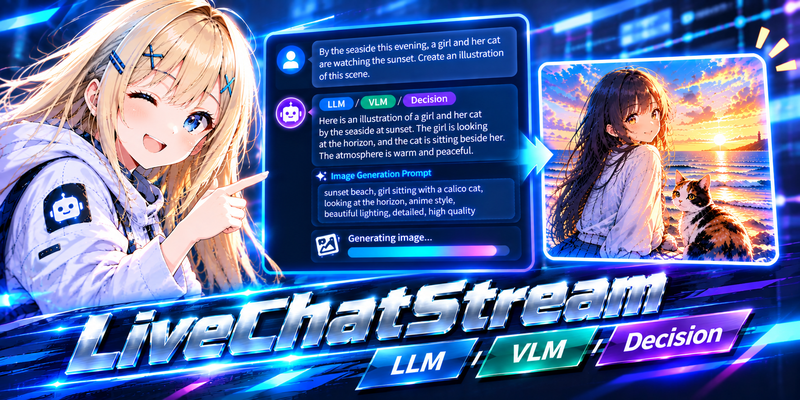

[English](README.md) | [日本語](README.ja.md) | 中文

# ComfyUI-LiveChatStream

一个 ComfyUI 自定义节点:**与 LLM / VLM 聊天,并将流式回复转为图片**。
模型一写完提示词,就会在回复仍在流式输出的过程中开始生成图片。

目前后端为 [Ollama](https://ollama.com)(节点名称与后端无关,以便日后添加其他后端)。

## 前提条件

- 在本地运行的 [Ollama](https://ollama.com)(默认 `http://127.0.0.1:11434`;其他主机请见*注意事项*)
- 至少一个聊天模型。附加图片(VLM)需要支持 `vision` 的模型。
- 可选:支持图片输入的*决策模型*(如 `clef`,需要 Ollama 0.35.1 或更高版本),用于评判生成的图片。决策模型不生成文本,而是以概率回答带类型的问题(是/否、选择、评分)。
- 同一工作流中的文生图流程(示例使用 SDXL + LCM LoRA)

## 安装

将本仓库放入 `ComfyUI/custom_nodes/` 并重启 ComfyUI。无需额外的 Python 依赖。

## 功能

- 在节点内**聊天**(逐 token 流式输出,带停止按钮)
- **两条提示词通道**
  - **A**(`positive` / `negative`):从回复的 `<prompt>` 块中取出的规范图片提示词
  - **B**(`chat_p` / `chat_n`):将模型自身的思考、回复或内心独白(`<mind>` 块)**原样**用作第二条提示词,让你以图片的形式看到角色的感受与想法
- **流式输出时生成**:`</prompt>` 结束时(默认)/ 流式输出中持续生成 / 手动
- 在弹窗中管理**预设 / 角色**(保存在服务器):普通系统提示词,或结构化角色(性格、固定外观标签、情感表达规则),保持角色一致并把情感画进图里
- **图片输入 / 输出(I2I)**:将图片连接到 `image` 输入(优先于拖放的图片),或拖放 / 粘贴 / 选择;把 `image` 输出接到 `VAE Encode` 即可图生图
- **VLM**:在聊天中附加图片(拖放、点击、粘贴)
- **决策模型评判**(可选):为每张生成的图片评分,判断是否符合要求及其质量
- **VRAM 管理**:手动的 `卸载` 按钮,以及生成图片前卸载 Ollama 模型的选项(`自动释放` 根据驱动实测的空闲显存,只卸载达到目标所需的模型数量)
- **图片 开/关** 复选框:关闭后即为普通聊天
- *设置* / *提示词* 可折叠(聊天为主区域)
- 支持英语 / 日语 / 简体中文(跟随 ComfyUI 的语言设置;更改后请刷新页面)

## 节点

### Live Chat Stream(`LiveChatStream`)

| 输出 | 类型 | 说明 |
| --- | --- | --- |
| `positive` / `negative` | STRING | 通道 A 的提示词(接到 `CLIP Text Encode`) |
| `response` | STRING | 完整回复(流式输出时持续更新) |
| `chat_p` / `chat_n` | STRING | 通道 B 的提示词(思考 / 回复 / `<mind>`)及其负面提示词 |
| `thinking` | STRING | 模型的思考文本 |
| `image` | IMAGE | 输入的图片(socket 或拖放的图片);没有图片时会阻止下游节点执行 |

输入:`image`(可选)。提示词框可在节点的 *提示词* 区域编辑。

## 使用方法

1. 打开 `workflows/live_chat_stream.json`(文生图)或 `workflows/live_chat_stream_i2i.json`(图生图)。
2. 展开 **设置**,确认 Ollama 的 URL,并选择 LLM / VLM(需要评判时再选决策模型,即界面中标有 `VLA` 的一行)。
3. 输入消息并按 `Ctrl+Enter`。`<prompt>` 块一完成就会生成图片。

提示

- 角色请在 **预设…** 中通过 `+ 角色` 创建,然后点击 `保存并使用`。
- 将 `chat_p = <mind> 块` 选中后,角色会写出内心独白。勾选 **mind 英文** 可让其用英文书写(图像模型更擅长英文)。
- 显存较小时,请设置 **VRAM: 自动释放** 和目标值(例如 8 GB),这样会在生成图片前卸载 Ollama 模型。正在流式输出回复的聊天模型不会被卸载。

## 注意事项

- 空闲 VRAM 通过 `nvidia-smi` 获取(NVIDIA GPU)。其他 GPU 会回退到 ComfyUI 自身的数值。
- 预设保存在 `<ComfyUI 的 user 目录>/live_chat_stream/presets.json`。
- 为 I2I 拖放的图片会上传到 `input/live_chat_stream/`。
- **Ollama 地址在服务器端设置,绝不会从浏览器或请求中获取。** 服务器从环境变量 `LIVE_CHAT_STREAM_OLLAMA_URL` 或 `<ComfyUI 的 user 目录>/live_chat_stream/config.json`(`{"ollama_url": "http://192.168.1.20:11434"}`,修改后无需重启)读取,未设置时使用 `http://127.0.0.1:11434`。不会跟随重定向。如果使用 `--listen` 启动 ComfyUI,任何能访问 ComfyUI 的人仍可对*你的* Ollama 使用聊天接口(但无法指向其他地址),因此请仅在可信网络中这样做。
